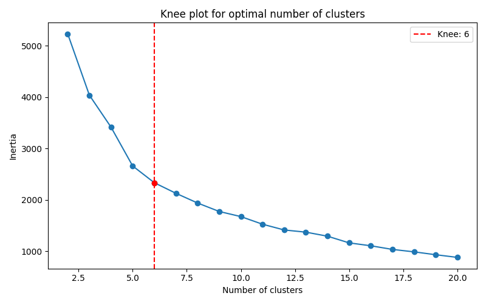

# Context Rot: Needle in a Haystack Reimplementation

## Overview
The [Context Rot](https://research.trychroma.com/context-rot) paper, recently released by the Chroma team, investigates the role of context in language model performance. The authors propose "context engineering" as a field to optimize context structure and evaluate its impact through three problems:

- **Needle in a Haystack:** Retrieving a specific piece of information (the "needle") from a larger context (the "haystack").
- **Conversation History Impact:** Assessing how context size and structure affect performance in conversational tasks.
- **Replicating Text with Unique Words:** Testing the model's ability to replicate text containing a unique word amidst repeated sequences.

This README describes my modest attempt to reimplement the needle in a haystack experiment, inspired by the original paper. 

## Experimentation Protocol
In the needle in a haystack experiment, a specific piece of information (the needle) is embedded within a larger context (the haystack). The model's retrieval ability is tested under controlled conditions:

- **Distractors:** The effect of misleading information is evaluated with configurations of no distractors, a two distractor, four distractors, eight distractors and sixteen distractors.
- **Context Size:** Eight different input lengths are tested to assess the impact of context size.
- **Needle Position:** The needle is placed in 5 distinct positions within the context (e.g., beginning, middle, end) to examine positional effects.

The original protocol involves splitting documents into chunks, generating embeddings, reducing dimensionality with UMAP, clustering with HDBSCAN, and selecting 20 representative chunks from the largest cluster using Maximum Marginal Relevance (MMR) to ensure diversity.

## Differences in Reimplementation
The reimplementation deviates from the original paper in several ways:

- **Dataset:** Manuscripts from [H.P. Lovecraft](https://www.hplovecraft.com/writings/fiction/) were used instead of the original dataset.
- **Clustering Algorithm:** K-means clustering with a knee locator to determine the number of clusters (e.g., 6) replaced HDBSCAN, as HDBSCAN produced a single dominant cluster, reducing diversity.

- **Evaluation Metric:** Accuracy (correct identification of the needle - Alhazred’s Codex) was used instead of Levenshtein distance, simplifying evaluation.
- **Needle and Question:** A specific question ("What was the name of the book hidden beneath the gnarled oak in the blighted landscape described in the text?") and needle (e.g., "The book hidden beneath the gnarled oak in the blighted landscape was titled Alhazred’s Codex") were introduced.

These modifications reflect practical adaptations to the dataset and evaluation preferences.

## Results
The reimplementation tested multiple models and configurations, yielding results for two scenarios: logical context (sequential text) and shuffled context (randomized sentences). Charts illustrate the findings below.

### Logical Context
Using the "At the Mountains of Madness" manuscript, GPT-3.5 Turbo and o4-mini were compared:

- **Accuracy by Number of Distractors:**
  /accuracy_by_distractors.png)
- **Accuracy by Needle Position:**
  /accuracy_by_position.png)
- **Accuracy by Number of Tokens:**
  /accuracy_by_tokens.png)
- **Overall Accuracy per Model:**
  /accuracy_per_model.png)
- **Heatmap of Accuracy:**
  /heatmap_all_models.png)

Accuracy decreases with more distractors. Unlike the paper's finding of no positional correlation, both models exhibit higher accuracy for needles at the beginning of the context. o4-mini significantly outperforms GPT-3.5 Turbo.

### Shuffled Context
Using shuffled sentences from cluster two, GPT-3.5 Turbo, o4-mini, GPT-4.1, and Gemini 2.5 Flash were evaluated:

- **Accuracy by Number of Distractors:**
  /accuracy_by_distractors.png)
- **Accuracy by Needle Position:**
  /accuracy_by_position.png)
- **Accuracy by Number of Tokens:**
  /accuracy_by_tokens.png)
- **Overall Accuracy per Model:**
  /accuracy_per_model.png)
- **Heatmap of Accuracy:**
  /heatmap_all_models.png)

Needle position has minimal impact, and the performance drop with increasing context size is less pronounced, consistent with the paper's observation that shuffled context improves performance. GPT-4.1 and o4-mini excel, while GPT-3.5 Turbo performs poorly.

## Limitations

My study is far less rigorous than the original, which used a broader range of models, varied needles, and larger contexts. The single needle likely skews results, as it doesn't capture the variability tested in the paper. My smaller context sizes and fewer models further limit the scope, making my findings a preliminary exploration rather than a definitive replication.

## Conclusion

This reimplementation offers a glimpse into the ContextRot paper's needle in a haystack experiment, confirming some findings (e.g., better performance with shuffled context) while suggesting positional biases in logical contexts. However, due to my use of a single needle, low variability of models and smaller-scale setup, these results should be interpreted cautiously. I encourage readers to refer to the original [Context Rot](https://research.trychroma.com/context-rot) paper for a more thorough and rigorous analysis.